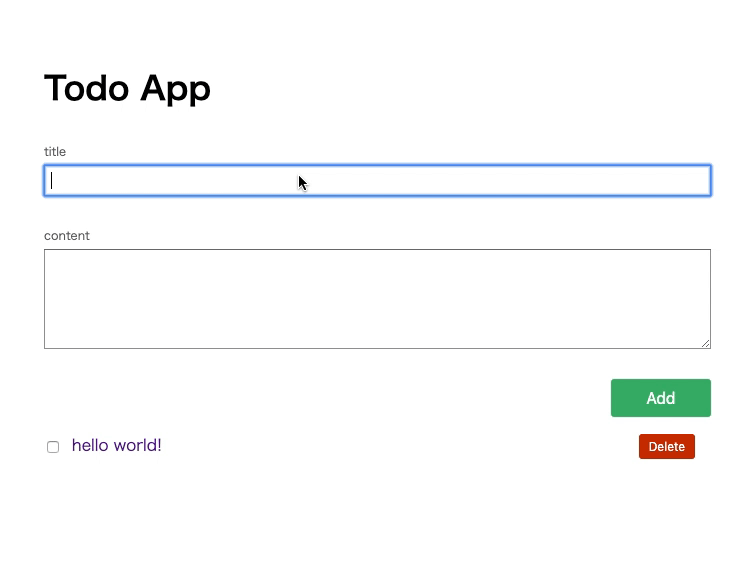

# react の基本と設計パターンを学ぼう

これはサポーターズ Colab での勉強会用の参考アプリです。スライドの後半部分の内容です。あえてアプリを肥大化させて設計の具体例を盛り込んだので頑張ってコード読んでみてください。



## 起動方法

ローカルで build

```shell
$ git clone https://github.com/Dragon-taro/spz-react.git
$ cd spz-react
$ npm i
$ npm start
```

docker でサクッと build

```shell
$ git clone https://github.com/Dragon-taro/spz-react.git
$ cd spz-react
$ docker-compose up
```

どっちも[](localhost:8080)に立ち上がります。

ちなみに docker の方は multi stage build 使ってます。一個目のコンテナで react の build をして二個目のコンテナに渡してます。

## 構成

### `src/`

主にメインのファイルはここに入ってます。この中にも README 書いておいたんでそれを参考にしてください。

### `server.js`

express のホスティング・リライト・静的ファイルの配信・簡単な API サーバーです。

### その他設定ファイル

webpack で babel を使って build してるだけなんでけっこう普通の構成です。
