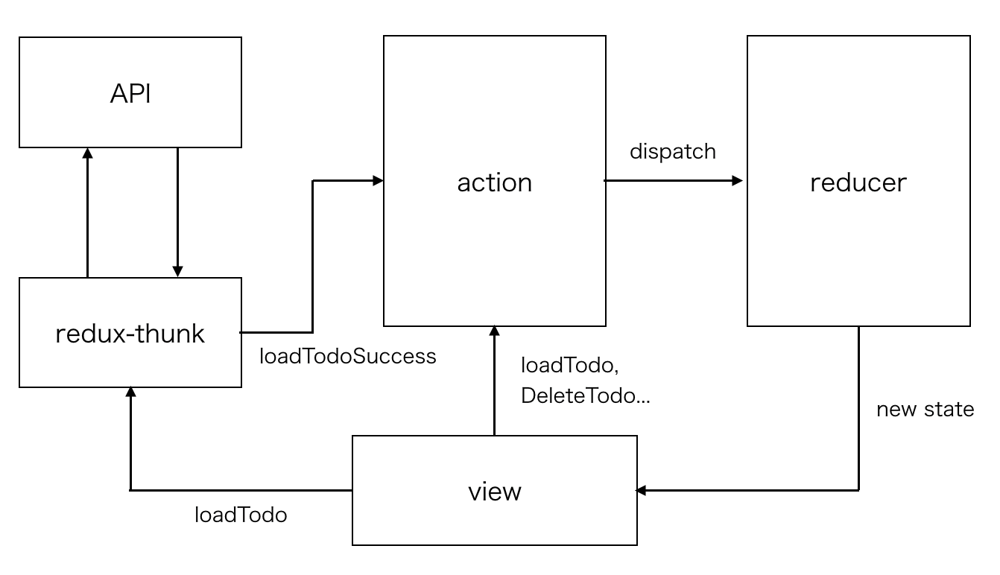

# redux

state に関するコードはここに書いてあります。[ducks](https://webbibouroku.com/Blog/Article/redux-ducks)パターンと[re-ducks](https://noah.plus/blog/021/)パターンのいいとこ取りで実装しています。

## ディイレクトリ構成

state ごとに大きく分けていて、その中は

- action: action の定義（定数もまとめてる）
- reducer: reducer のロジック
- effect: 副作用がある処理（主に非同期）

という構成です。

## フロー図

